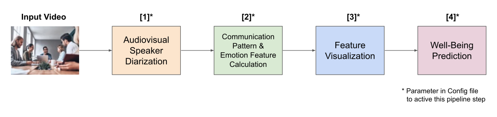

<h1 align="center">Leveraging Speech Features for Automated Analysis of Well-Being in Teamwork Contexts</h1>

*Repository for the master's thesis of Tobias Zeulner*


<p align="center">
  <a href="https://www.python.org/downloads/release/python-380/"></a>
  <a href="https://github.com/Zeulni/wellbeing-audio-analysis/blob/main/LICENSE"></a>
  <a href="https://www.linkedin.com/in/tobias-zeulner-893080169/"></a>
</p>


<p align="center">
  <a href="#about-this-project">About this Project</a> •
  <a href="#key-features">Key Features</a> •
  <a href="#how-to-use">How To Use</a> •
  <a href="#license">License</a>
</p>

## About this Project

Current methods for assessing employee well-being rely primarily on irregular and time-consuming surveys, which limits proactive measures and support. This thesis addresses this problem by developing predictive algorithms to automatically assess well-being. The algorithms are based on audio data collected in teamwork contexts.
A dataset of 56 participants who worked in teams over a four-day period was curated. The positive emotion, engagement, relationships, meaning, and accomplishment (PERMA) framework developed by Seligman consisting of five pillars was used to measure well-being. An audiovisual speaker diarization system was developed to enable the calculation of speech features at the individual level in a noisy environment. After extracting and selecting the most relevant features, regression, and classification algorithms were trained.

The best predictive model for each PERMA pillar is the two-class classification system. It achieves the following balanced accuracies: P: 78%, E: 50%, R: 74%, M: 61%, and A: 50%. 

The entire pipeline (see image below) and final models are provided in this GitHub repository.

## Key Features

The four main building blocks of this toolbox are shown in the figure below (with the corresponding outputs).


The final output of the pipeline is the prediction of well-being, which is done using regression (between 0-1 or 0-7) and classification (low vs. high). The parts can be run separately if, for example, the prediction of well-being is not required but other downstream tasks such as the prediction of team performance are.

## How To Use

I recommend to use the same Python version as I did to avoid conflicts (3.8.10). I also recommend to set up a new virtual environment in the venv folder.

<details>
<summary>How to set up a virtual environment in Python 3 for Windows</summary>

```
python -m venv venv
.\venv\Scripts\activate
```
</details>
<details>
<summary>How to set up a virtual environment in Python 3 for MacOS/Linux</summary>

```
python3 -m venv venv
source venv/bin/activate
```
</details>

Then, install ffmpeg (which is needed to process the video recordings).
<details>
<summary>How to install ffmpeg on Windows/Linux/MacOS</summary>

- [Windows 10](https://www.youtube.com/watch?v=r1AtmY-RMyQ&ab_channel=TroubleChute)
- [Linux Ubuntu](https://www.youtube.com/watch?v=tf4p-SMw5jA&ab_channel=RickMakes)
- [MacOS (M1)](https://www.youtube.com/watch?v=nmrjRqEIgGc&ab_channel=DavidHelmuth)

</details>

Clone the repository and install the required packages:

```
pip install -r requirements.txt
```

Place a video to be processed in the folder `src/audio/videos`. If you do so, then provide the filename (without ending like "mp4") of that video in the config file (see `configs/config.yaml`). Alternatively to get started, you can use the short demo video. For this you can leave the initial value in the config file (`001`). Later on, feel free to have a look at all the other adjustable parameters in the configuration file and adapt them to your needs.

Run the main file:
```
python main.py
```
or 
```
python3 main.py
```
depending on your Python installation.

Note: Running the script on a GPU can accelerate it by a factor of 4x-8x. 


## :page_facing_up: License

Distributed under the MIT License. See `LICENSE` for more information.

---

> Email:  <a href="mailto:tobias.zeulner@tum.de">tobias.zeulner@tum.de</a>
 &nbsp;&middot;&nbsp;
> LinkedIn: <a href="https://www.linkedin.com/in/tobias-zeulner-893080169/" target="_blank">Tobias Zeulner</a>

